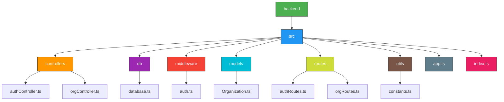
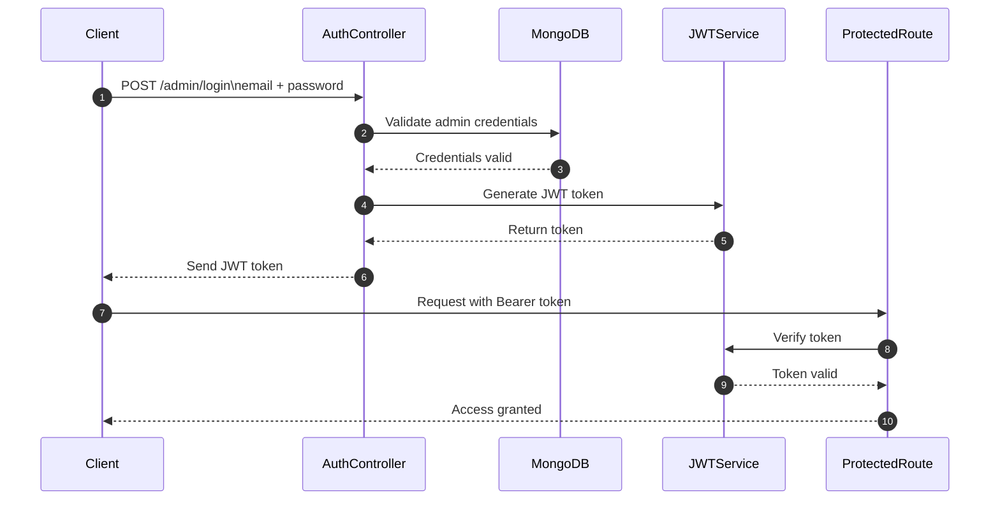
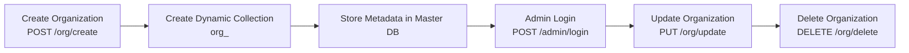

#  Organization Management Backend (Multi-Tenant Architecture)

This project is a backend service built using **Node.js**, **Express**, **TypeScript**, and **MongoDB** to manage organizations in a **multi-tenant architecture**.  
Each organization gets a **dedicated dynamic MongoDB collection**, its own **admin user**, and secure **JWT authentication**.

----------------------------------------------------------------------------------------------------------------------------------------------------------------------------------

##  Features

### 🏢 Organization Management
- Create a new organization with:
  - Unique organization name validation  
  - Dynamic MongoDB collection creation `org_<organization_name>`  
  - Admin user creation  
  - Metadata stored in Master DB  
- Get organization by name  
- Update an existing organization  
- Delete organization (only authenticated admin can delete)

###  Authentication
- Admin login (email + password)
- JWT-based authorization
- Password hashing using **bcrypt**

--------------------------------------------------------------------------------------------------------------------------------------------------------------------------------

### Project Architecture Flowchart

----------------------------------------------------------------------------------------------------------------------------------------------------------------------------------

---------------------------------------------------------------------------------------------------------------------------------------------------------------------------------
**Organization Lifecycle Diagram (Create → Update → Delete)**

----------------------------------------------------------------------------------------------------------------------------------------------------------------------------------
**Quick Start**
                   => Clone the repository
                   => git clone https://github.com/Jyot-vasava/backend_ts_task
Install deps
                     => npm install
    
create a .env file:
                      =>JWT_SECRET
                      =>MONGO_URI
                      =>PORT
                      =>NODE_ENV
                      =>MONGO_DB_NAME

then:
                       =>npm run dev

-------------------------------------------------------------------------------------------------------------------------------------------------------------------------------------
 **Additional Questions — Answer**
✅ Is this a good architecture with a scalable design?

Yes — the proposed architecture using a master database + dynamic collections for each organization is a valid, functional, and moderately scalable approach for multi-tenancy.

It provides key benefits:

✔ 1. Logical Separation Per Organization

Each organization gets its own MongoDB collection (e.g., org_companyA) which keeps their data isolated.
This reduces the risk of cross-tenant data leakage and simplifies query logic.

✔ 2. Simple and Fast to Implement

Dynamic collection creation is easy with MongoDB.
It allows rapid onboarding of new organizations without changing the schema.

** Trade-offs and Limitations**
 1. Single Database = Single Point of Failure

All tenants rely on one database instance.
If the master DB goes down, all organizations are affected.

 2. Collection Growth May Cause Performance Issues

MongoDB performs well with many documents,
but too many collections (hundreds or thousands) can slow:
Indexing
Query planner performance
Disk metadata operations

 3. Harder to Scale Beyond a Limit

As data grows, vertical scaling becomes expensive.
Tenants with heavy traffic may impact others.

